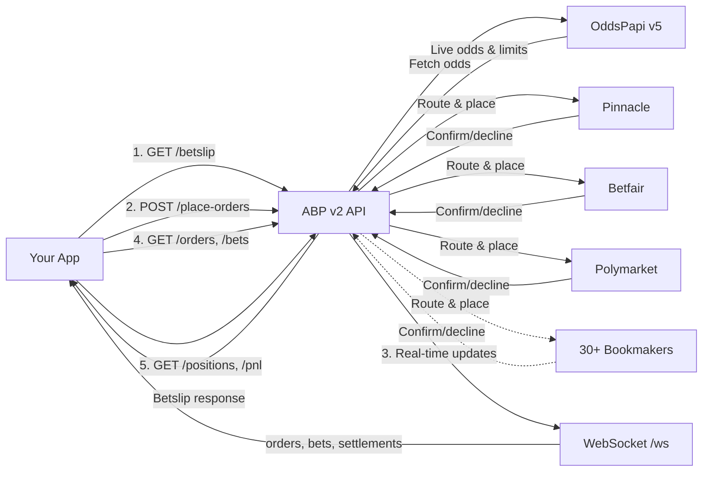

## What is ABP?

The **Automated Bet Placing (ABP)** API lets you place bets across 30+ bookmakers through a single integration. Instead of building and maintaining individual bookmaker connectors, ABP handles the entire lifecycle from bet placement through settlement.

**Core capabilities:**

- **Account management** — Full CRUD for bookmaker accounts with priority-based selection, per-account stake limits, and multi-currency support
- **Betslip retrieval** — Get real-time odds and limits for any fixture/outcome across all configured bookmakers before placing
- **Smart order routing** — Place single or bulk orders; ABP automatically selects the best bookmaker by odds and limits
- **Bet tracking** — Monitor every bet from placement through confirmation and settlement with full audit trail
- **Position & PnL analytics** — Aggregated views of exposure and profit/loss grouped by bookmaker, account, or user reference

## Data flow



1. **Betslip** — Your app fetches live odds from ABP, which queries OddsPapi v5 for real-time pricing
2. **Place orders** — ABP routes orders to the best bookmaker(s) based on odds, limits, and account priority
3. **Real-time updates** — WebSocket pushes order, bet, and settlement events as they happen
4. **Query** — REST endpoints for order/bet history and analytics

## Base URL

```
https://v2.55-tech.com
```

## Key concepts

### Orders vs bets

An **order** is your instruction to place a bet. A **bet** is the actual wager placed on a bookmaker. One order can result in multiple bets when using partial fills or multi-bookmaker routing.

### Request deduplication

Each order requires a unique `requestUuid` (UUID format). ABP uses server-side deduplication (5-minute TTL) to prevent duplicate placements. Duplicate requests return `409 Conflict`.

### Order lifecycle

```
PENDING → PROCESSING → FILLED / PARTIALLY_FILLED / REJECTED / EXPIRED / CANCELLED / FAILED
```

- **PENDING** — Order received and queued
- **PROCESSING** — Routing to bookmakers
- **FILLED** — All stake placed successfully
- **PARTIALLY_FILLED** — Some stake placed, remaining expired or no capacity
- **REJECTED** — Failed validation (bad odds, invalid fixture, etc.)
- **EXPIRED** — Order `expiresAt` time reached (default: 5 seconds)
- **CANCELLED** — Explicitly cancelled by client
- **FAILED** — Internal error during placement

### Bet lifecycle

```
PENDING → CONFIRMED / DECLINED / CANCELLED
```

### Settlement lifecycle

```
UNSETTLED → WON / LOST / VOID / HALF_WON / HALF_LOST / PUSH / CASHOUT
```

- **Half won / Half lost** — Asian handicap partial results
- **Push** — Stake returned (tie on the line)
- **Cashout** — Early withdrawal at negotiated price

### Account priority

Each bookmaker account has a `priority` field (higher = preferred). When placing an order, ABP selects the highest-priority active account first for each bookmaker.

### Limit cascade

Stake limits are resolved in priority order: **account limits > bookmaker limits > odds limits**.

For example, if an account has `minStake: 10`, the bookmaker default is `minStake: 1`, and the odds entry shows `limitMin: 5`, the effective minimum is `10` (from the account override).

### Bookmaker slugs

Bookmakers are identified by slug strings (e.g., `pinnacle`, `betfair-ex`, `polymarket`). Use `GET /bookmakers` to list all 30+ supported bookmakers with their default stake limits.

## Endpoints at a glance

| Category | Endpoints | Description |
|----------|-----------|-------------|
| **Accounts** | `GET/POST/PATCH/DELETE /accounts` | Manage bookmaker accounts (credentials, balances, priority, limits) |
| **Betslip** | `GET /betslip` | Get live odds & limits before placing |
| **Orders** | `POST /place-orders`, `POST /cancel-orders`, `POST /cancel-all-orders`, `GET /orders` | Place, cancel, and track orders |
| **Bets** | `GET /bets`, `GET /bets/{bet_id}` | View individual bet results |
| **Analytics** | `GET /positions`, `GET /pnl` | Aggregated exposure and P&L |
| **Bookmakers** | `GET /bookmakers` | List all supported bookmakers |
| **Markets** | `GET /markets` | Available markets and odds types |
| **WebSocket** | `WS /ws` | Real-time updates |

## Supported bookmakers

**Traditional sportsbooks:** pinnacle, pinnacleb2b, betcris, bookmaker.eu, cloudbet, cloudbetb2b, justbet, kaiyun, matchbook, monkeyline.vip, novig.us, 198bet, paradisewager, sharpbet, singbet, sports411.ag, 3et

**Betting exchanges:** betfair-ex, smarkets

**Prediction markets:** polymarket, polymarket.us, kalshi, predict.fun, prophetx, sx.bet, vertex, 4casters

**Punter platforms:** punter.io

## Resilience

ABP includes production-grade reliability features:

- **Circuit breakers** — Per-bookmaker circuit breakers prevent cascading failures and auto-recover
- **Retry with exponential backoff** — for transient failures
- **Emergency controls** — Orders may be temporarily paused during system maintenance
- **Rate limiting** — Per-API-key rate limits (configurable per client)

## Data source

ABP consumes real-time odds data from [OddsPapi v5](https://docs.oddspapi.io/). Fixture IDs and outcome IDs in ABP correspond directly to OddsPapi identifiers.

## Next steps

<Columns cols={2}>
  <Card title="Authentication" icon="key" href="/abp-api/authentication">
    Set up your API key.
  </Card>

  <Card title="Quickstart" icon="rocket" href="/abp-api/quickstart">
    Place your first bet in 5 steps.
  </Card>
</Columns>
