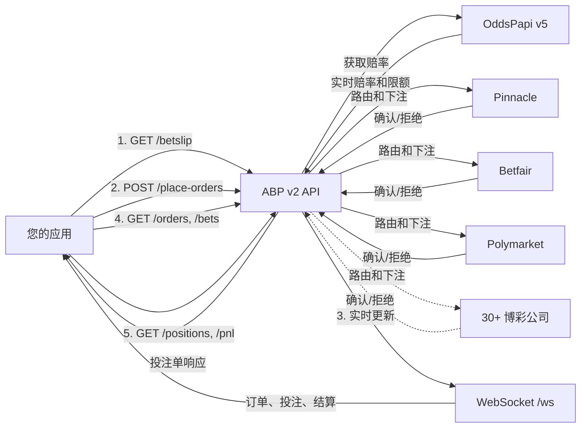

## 什么是 ABP？

**自动投注（ABP）** API 让您通过单一集成在30多家博彩公司进行投注。无需构建和维护各个博彩公司的连接器，ABP 处理从投注到结算的全部生命周期。

**核心能力：**

- **账户管理** — 博彩公司账户的完整CRUD操作，支持优先级选择、每账户投注限额和多币种
- **投注单获取** — 在下注前获取所有已配置博彩公司的任何赛事/结果的实时赔率和限额
- **智能订单路由** — 下达单个或批量订单；ABP 自动按赔率和限额选择最佳博彩公司
- **投注跟踪** — 从下注到确认和结算，完整审计追踪监控每一注
- **持仓和盈亏分析** — 按博彩公司、账户或用户引用分组的汇总敞口和盈亏视图

## 数据流



1. **投注单** — 您的应用从 ABP 获取实时赔率，ABP 查询 OddsPapi v5 获取实时定价
2. **下单** — ABP 根据赔率、限额和账户优先级将订单路由到最佳博彩公司
3. **实时更新** — WebSocket 在事件发生时推送订单、投注和结算更新
4. **查询** — REST 端点用于订单/投注历史和分析

## 基础URL

```
https://v2.55-tech.com
```

## 关键概念

### 订单 vs 投注

**订单**是您的下注指令。**投注**是在博彩公司实际放置的注单。使用部分成交或多博彩公司路由时，一个订单可能产生多个投注。

### 请求去重

每个订单需要唯一的 `requestUuid`（UUID格式）。ABP 使用服务端去重（5分钟TTL）防止重复下注。重复请求返回 `409 Conflict`。

### 订单生命周期

```
PENDING → PROCESSING → FILLED / PARTIALLY_FILLED / REJECTED / EXPIRED / CANCELLED / FAILED
```

- **PENDING** — 订单已接收并排队
- **PROCESSING** — 正在路由到博彩公司
- **FILLED** — 全部投注额已成功下注
- **PARTIALLY_FILLED** — 部分投注额已下注，剩余已过期或无容量
- **REJECTED** — 验证失败（赔率不对、赛事无效等）
- **EXPIRED** — 订单 `expiresAt` 时间已到（默认：5秒）
- **CANCELLED** — 客户端显式取消
- **FAILED** — 下注过程中出现内部错误

### 投注生命周期

```
PENDING → CONFIRMED / DECLINED / CANCELLED
```

### 结算生命周期

```
UNSETTLED → WON / LOST / VOID / HALF_WON / HALF_LOST / PUSH / CASHOUT
```

- **Half won / Half lost** — 亚洲盘部分结果
- **Push** — 退还投注额（平局）
- **Cashout** — 以协商价格提前提款

### 账户优先级

每个博彩公司账户有一个 `priority` 字段（值越高越优先）。下单时，ABP 为每个博彩公司优先选择最高优先级的活跃账户。

### 限额级联

投注限额按优先级顺序解析：**账户限额 > 博彩公司限额 > 赔率限额**。

例如，如果账户 `minStake: 10`，博彩公司默认 `minStake: 1`，赔率条目显示 `limitMin: 5`，有效最低值为 `10`（来自账户覆盖）。

### 博彩公司标识

博彩公司通过标识字符串识别（例如 `pinnacle`、`betfair-ex`、`polymarket`）。使用 `GET /bookmakers` 列出所有30多家支持的博彩公司及其默认投注限额。

## 端点一览

| 类别 | 端点 | 描述 |
|------|------|------|
| **账户** | `GET/POST/PATCH/DELETE /accounts` | 管理博彩公司账户（凭证、余额、优先级、限额） |
| **投注单** | `GET /betslip` | 下注前获取实时赔率和限额 |
| **订单** | `POST /place-orders`, `POST /cancel-orders`, `POST /cancel-all-orders`, `GET /orders` | 下单、取消和跟踪订单 |
| **投注** | `GET /bets`, `GET /bets/{bet_id}` | 查看单个投注结果 |
| **分析** | `GET /positions`, `GET /pnl` | 汇总敞口和盈亏 |
| **博彩公司** | `GET /bookmakers` | 列出所有支持的博彩公司 |
| **市场** | `GET /markets` | 可用市场和赔率类型 |
| **WebSocket** | `WS /ws` | 实时更新 |

## 支持的博彩公司

**传统体育博彩：** pinnacle, pinnacleb2b, betcris, bookmaker.eu, cloudbet, cloudbetb2b, justbet, kaiyun, matchbook, monkeyline.vip, novig.us, 198bet, paradisewager, sharpbet, singbet, sports411.ag, 3et

**博彩交易所：** betfair-ex, smarkets

**预测市场：** polymarket, polymarket.us, kalshi, predict.fun, prophetx, sx.bet, vertex, 4casters

**Punter平台：** punter.io

## 可靠性

ABP 包含生产级可靠性功能：

- **熔断器** — 每博彩公司熔断器防止级联故障并自动恢复
- **指数退避重试** — 用于瞬态故障
- **紧急控制** — 在系统维护期间订单可能会被临时暂停
- **速率限制** — 每API密钥的速率限制（每客户可配置）

## 数据源

ABP 从 [OddsPapi v5](https://docs.oddspapi.io/) 获取实时赔率数据。ABP 中的赛事ID和结果ID直接对应 OddsPapi 标识符。

## 下一步

<Columns cols={2}>
  <Card title="身份验证" icon="key" href="/zh/abp-api/authentication">
    设置您的API密钥。
  </Card>

  <Card title="快速入门" icon="rocket" href="/zh/abp-api/quickstart">
    5步完成您的首次投注。
  </Card>
</Columns>
