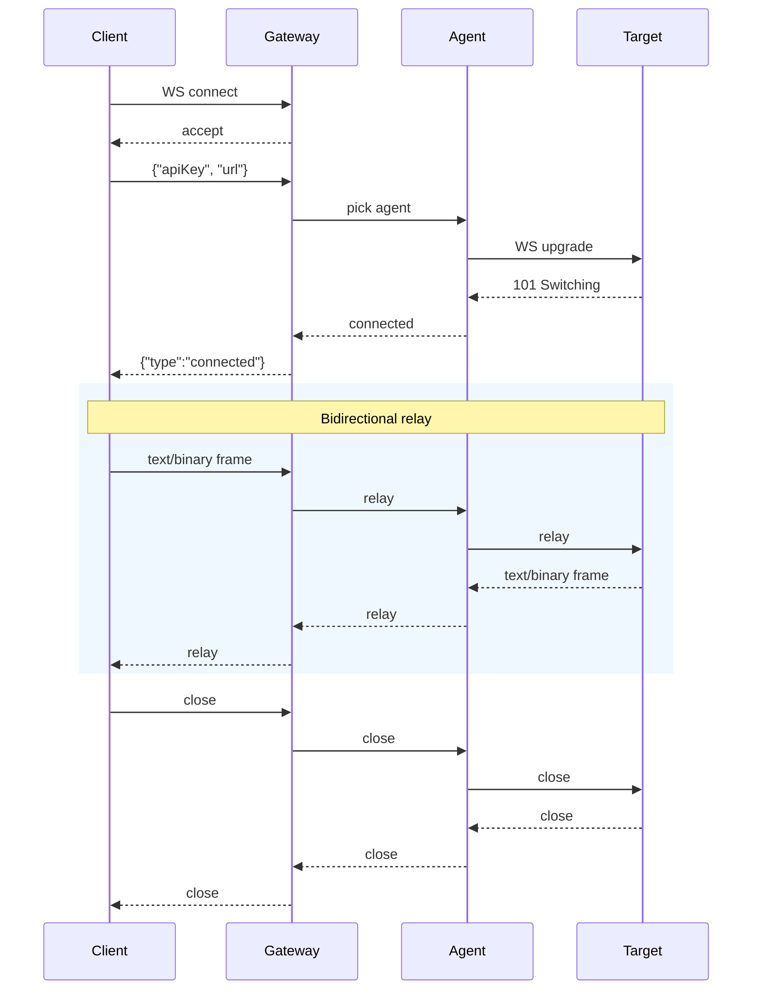

## 协议概述

`wss://scraping-api.55-tech.com/ws` 上的 WebSocket 中继提供双向代理功能。您连接到网关，发送一条 JSON 连接消息，网关通过地理分布式代理节点在您和目标之间中继所有帧。

```
Client ←→ Gateway (wss://.../ws) ←→ Agent ←→ Target WebSocket
```

## 交��式测试页面

`/ws/docs` 端点返回协议格式：

```bash
curl https://scraping-api.55-tech.com/ws/docs
```

```json
{
  "type": "connected",
  "status": 101,
  "node_id": "scraping-de1",
  "message": "This is a documentation endpoint. Connect via WebSocket at wss://scraping-api.55-tech.com/ws"
}
```

要进行交互式 WebSocket 测试，请使用 `wscat`：

```bash
npm install -g wscat
wscat -c wss://scraping-api.55-tech.com/ws
```

然后粘贴：
```json
{"apiKey":"YOUR_API_KEY","url":"wss://echo.websocket.events"}
```

## 连接消息（客户端 → 网关）

必须在连接后 **10 秒**内以 JSON 文本形式发送。

```json
{
  "apiKey": "YOUR_API_KEY",
  "url": "wss://target.example.com/stream",
  "headers": {
    "Authorization": "Bearer token",
    "Origin": "https://target.example.com"
  },
  "cookies": {
    "session": "abc123"
  },
  "geo": "US,DE",
  "agent": "de1",
  "idle_timeout": 0
}
```

### 字段说明

| Field | Type | Required | Default | Description |
|-------|------|----------|---------|-------------|
| `apiKey` | string | **Yes** | — | 用于身份验证的 API 密钥。也接受 `key`。 |
| `url` | string | **Yes** | — | 目标 WebSocket URL（`wss://...` 或 `ws://...`） |
| `headers` | object | No | `{}` | 随 WS 升级请求发送到目标的自定义请求头。适用于目标期望的 `Authorization`、`Origin`、`Cookie` 等请求头。 |
| `cookies` | object | No | `{}` | 随 WS 升级请求发送的 Cookie。会合并到 `Cookie` 请求头中。 |
| `geo` | string | No | — | 将代理节点选择限制到特定国家。逗号分隔的 ISO 代码（例如 `US,DE,AT`）。 |
| `agent` | string | No | — | 通过标识固定到特定代理节点（例如 `de1`），或逗号分隔进行随机选择（`de1,at5,us3`）。 |
| `idle_timeout` | float | No | `0` | 如果 > 0，在指定秒数内未收到目标消息后断开连接。`0` = 不超时。 |

## 响应消息（网关 → 客户端）

### Connected

代理节点成功连接到目标 WebSocket 后发送一次。

```json
{
  "type": "connected",
  "status": 101,
  "node_id": "scraping-de1"
}
```

| Field | Type | Description |
|-------|------|-------------|
| `type` | string | 始终为 `"connected"` |
| `status` | int | WS 升级的 HTTP 状态码。`101` = 成功。 |
| `node_id` | string | 处理中继的代理节点（例如 `scraping-de1`） |

### Error

连接失败或发生错误时发送。此消息发送后 WebSocket 将关闭。

```json
{
  "type": "error",
  "message": "Invalid or missing API key"
}
```

| Field | Type | Description |
|-------|------|-------------|
| `type` | string | 始终为 `"error"` |
| `message` | string | 人类可读的错误描述 |

### 中继帧

在 `connected` 消息之后，所有后续帧均为原始中继 — 无 JSON 包装。文本帧保持为文本，二进制帧保持为二进制。

## 关闭代码

| Code | Meaning |
|------|---------|
| `1000` | 正常关闭（您或目标关闭了连接） |
| `1008` | 策略违规 — API 密钥无效、速率限制或连接超时 |
| `1011` | 内部错误 — 代理节点故障或目标不可达 |

## 错误场景

| Scenario | What happens |
|----------|-------------|
| 10 秒内未发送连接消息 | 网关以代码 `1008` 关闭 |
| API 密钥无效 | 网关发送错误 JSON，以 `1008` 关闭 |
| 超出速率限制 | 网关发送错误 JSON，以 `1008` 关闭 |
| 目标拒绝连接 | 网关发送错误 JSON，以 `1011` 关闭 |
| 无可用代理节点 | 网关发送错误 JSON，以 `1011` 关闭 |
| 目标关闭连接 | 网关转发关闭帧，包含目标的代码和原因 |
| 客户端关闭连接 | 网关将关闭转发到目标，清理资源 |
| 代理节点在中继过程中崩溃 | 网关以 `1011` 关闭 |

## 帧流程图



## 速率限制

WebSocket 连接在连接时（连接消息验证通过后）从您的速率限制桶中消耗 **1 个令牌**。后续帧不消耗令牌。如果您的桶为空，网关会发送错误并以 `1008` 关闭连接。

## 使用 wscat 测试

```bash
# Install
npm install -g wscat

# Connect
wscat -c wss://scraping-api.55-tech.com/ws

# Paste connect message:
{"apiKey":"YOUR_KEY","url":"wss://echo.websocket.events"}

# After "connected" response, type messages to relay:
hello world

# The echo server will send back your message
```

## 使用 Python 测试

```python
import asyncio
import json
import websockets

async def test():
    async with websockets.connect("wss://scraping-api.55-tech.com/ws") as ws:
        await ws.send(json.dumps({
            "apiKey": "YOUR_API_KEY",
            "url": "wss://echo.websocket.events",
        }))

        resp = json.loads(await ws.recv())
        print(f"Status: {resp}")

        if resp["type"] == "connected":
            await ws.send("test message")
            reply = await ws.recv()
            print(f"Echo: {reply}")

asyncio.run(test())
```
